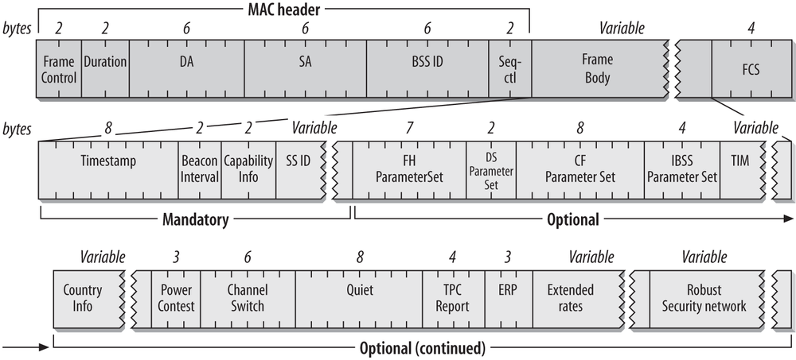

### WiFi Beacon
<details>

  <summary> <b> Theory </b> </summary>

* Abbreviation
  * SSID: Service Set ID (Network ID)
  * BSSID: basic SSID    (Equipment ID)
  * DS: Distribution System or Direct Sequence
* IEEE 802 family: 802.3 Ethernet, 802.11 Wi-Fi
* 802.11 MAC Frame
  * Data Frame
  * Control Frame
  * Management Frame: They are used to join and leave networks and move associations from AP to AP.
    * <b>Beacon Frame</b>
* Beacon Frame is one type of 802.11 Mgmt frame (Ref1: [Book Chapter](https://www.oreilly.com/library/view/80211-wireless-networks/0596100523/ch04.html))
  * A Generic Management Frame
  </img>
  * Beacon Frame
  </img>
    ```
    8000         Frame Control (see a detailed definition in next section)
    0000         Duration
    ffffffffffff DA
    485d36932fe0 MAC of a WiFi Hotspot
    485d36932fe0 BSSID
    dcc_         Sequence Number
    ___0         Fragment Number 
    ```
    </img>
  * Frame Control
    ```
    0x00 = _______________0 To DS (Distr Sys)
         = ______________0_ From DS
         = _____________0__ More Fragments
         = ____________0___ Retry
         = ___________0____ Power Management
         = __________0_____ More Data
         = _________0______ WEP (wired equivalent privacy), Protected flag
         = ________0_______ Order

    0x80 = ______00________ Protocol Version (only one is availiable at this moment)
         = ____00__________ Frame Type (00 is mgmt, 01 ctrl, see Table 3-1 o the Ref 1)
         = 1000____________ Subtype (1000: beacon, 0100: probe request)
    ```
  * Frame Body<br/>
    * Fixed Parameters
    </img>
      ```
       98 c1 51 43 04 01 00 00 = 0x000001044351c198 (least sig byte first) = 1117820928408 Timestamp
       6400 = 0x0064 = 100 time unit (1TU = 1.024ms) Beacon Internal
       3114 = 0x1431 = 0001_0100_0011_0001 Capabilities Info
      ```

    * Tagged Parameters
    </img>
      ```
      00 = 0x00                           Element ID / Tage type (0: SSID, 1: Supported Rate)
      0a = 0x0a = 10                      Length of SSID string "FiOS-MP0YN"
      46 69 4f 53 2d 4d 50 30 59 4e       ASCII string of SSID "FiOS-MP0YN"
      ```
      </img>
##### Endianness
* 0110_0100_0000_0000 = 64 00 (received bits in little-endian) = 0x0064 (real data) = 100
* We want to send an integer 100 complied to 802.11 standard, we follow little endian rule and send the last octet first.

</details>

### Dev Env
* IDF: [4.4.2](https://github.com/xg590/IoT/tree/master/FreeRTOS)
* ESP32: [USB32](https://github.com/xg590/IoT/tree/master/Board/Espressif/ESP32/USB32)
### Usage
``` 
IDF_PATH=/opt/esp_dev/esp_idf_442 && . $IDF_PATH/export.sh
idf.py set-target esp32
git clone https://github.com/xg590/ESP32_Beacon.git
cd ESP32_Beacon
idf.py build && esptool.py --chip esp32 -p /dev/ttyUSB0 erase_flash && idf.py -p /dev/ttyUSB0 flash
screen /dev/ttyUSB0 115200
``` 